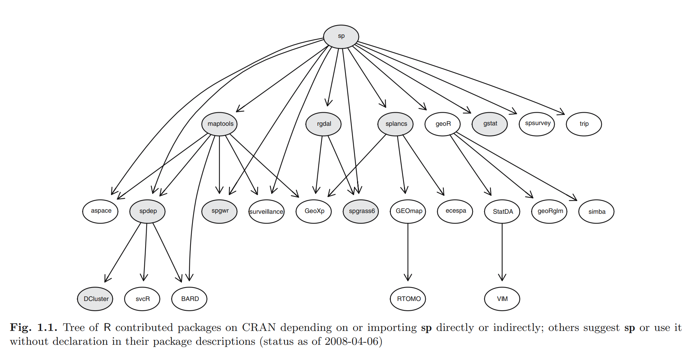

[cran_spatial_task]: https://cran.r-project.org/web/views/Spatial.html
[marco_geostadistco_mexico]: http://www.inegi.org.mx/geo/contenidos/geoestadistica/m_geoestadistico.aspx
[conabio_gis]: http://www.conabio.gob.mx/informacion/gis/
[global_admin_areas]: http://www.gadm.org/
[gbif]: http://www.gbif.org/
[iucn]: http://www.iucnredlist.org/technical-documents/spatial-data/ 
[open_street_map_data]: http://openstreetmapdata.com/data
[natural_earth_data]: http://www.naturalearthdata.com/
[usgs]: https://earthexplorer.usgs.gov/
[copernicus]: https://scihub.copernicus.eu/dhus/#/home
[fao]: http://www.fao.org/geonetwork/srv/en/main.home
[opentopography]: http://www.opentopography.org/
[unep]: http://geodata.grid.unep.ch/
[neo_nasa]: https://neo.sci.gsfc.nasa.gov/
[srtm]: http://srtm.csi.cgiar.org/
[ipums_terra]: https://www.terrapop.org/
[sedac]: http://sedac.ciesin.columbia.edu/data/sets/browse
[hydrosheds]: https://hydrosheds.cr.usgs.gov/dataavail.php
[waterloo]: https://uwaterloo.ca/library/geospatial/collections/us-and-world-geospatial-data-resources

```{r set_options, echo = FALSE, include = FALSE}
options(width = 100)
knitr::opts_chunk$set(echo = TRUE, warning = FALSE, message = FALSE, size = "small")
```
## Datos espaciales

- Datos que representan ubicaciones, formas y tamaños de entidades en el planeta.
- Generalmente acompañados de atributos o metadatos.
- Inicialmente desarrollados para sistemas de información geográfica.
- Por ejemplo, el [marco geoestadístico de México](marco_geoestadistico_mexico)

Estos objetos representan un reto para la ciencia de datos, ya que su almacenamiento
y procesamiento no se realiza de manera convencional debido a su estructura.

## Estructura de datos espaciales
- Datos vectoriales:
    + Puntos: Dimensión 1. Cada punto es representado por un par de codenadas (x, y).
    + Líneas: Dimensión 2. Múltiples puntos conectados en un orden.
    + Polígonos: Dimensión 2. Múltiples líneas conectadas. Estas líneas no se
    intersectan y la última línea debe terminar en el inicio de la primera.

- Datos raster: Representan mediciones sobre un espacio geográfico. Estas mediciones
  son agrupadas en celdas que conforman una grilla. Cada celda debe representar
  las mediciones en el área que abarque. El tamaño de la celda da la propiedad
  de resolución.

## Soporte en software
- GIS:
    + ArcGIS
    + OpenGIS
    + GRASS
    + QGIS
- Bases de datos espaciales:
    + PostGIS
    + SQL Server
    + MySQL
    + Redis
- Lenguajes de programación:
    + Python (shapely, geopy, ogr/gdal)
    + C++ (GEOS, GDAL)
    + Java (GeoTools)
    + Scala (GeoSparkl, SpatialSpark)
    + R

## Librerías en R
- Data structures
    + sp
    + sf
    + raster
- Manipulation
    + rgdal
    + rgeos
    + maptools
    - geosphere
- Visualizaton
    + ggplot2
    + ggmap
    + leaflet
    + plotkml

Más en la siguiente [liga](cran_spatial_tasks)

## Instalación

```{r packages}
pkgs <- c(
  "magrittr", "Rcpp", "data.table", "sp", "raster", "sf", "rgdal", "geosphere",
  "dismo", "maps", "maptools", "ggplot2", "ggmap", "jsonlite"
)
# install.packages(pkgs, repos = "https://cran.itam.mx/")
sapply(pkgs, require, character.only = TRUE)
```

## Dependencias en CRAN


# Data structures

## Librerías con estructuras de datos espaciales
### Clases de datos vectoriales en R

- sp: Librería estándar para manipulación de datos vectoriales en R.
- sf: Experimental. Sigue el estándar ISO 19125-1:2004.

### Clases de datos raster en R

- sp: clase `SpatialGrid*`
- raster: clases `Raster*`

## `sp`: Classes and methods for spatial data
La librería da soporte a las clases:

- `CRS`
- `SpatialPoints*`
- `SpatialLines*`
- `SpatialMultiPoints*`
- `SpatialPolygons*`
- `SpatialGrid*`
- `SpatialPixels*`

Todas estas clases están acompañadas de un constructor que permite incluir los
metadatos en forma de un data.frame. Por ejemplo, `SpatialPointsDataFrame` recibe
como argumento adicional los metadatos para cada punto.

## SpatialPoints
- Por convención el formato default para coordenadas es (lon, lat).
- Además de especificar las coordenadas necesitamos especificar un CRS.

```{r spatial_points}
example_crs <- CRS("+proj=longlat +datum=WGS84") # Creamos el sistema de coordenadas
example_points <- data.frame(                    # Creamos un data.frame con 10 coordenadas 
  longitud = runif(10, -118, -87),               # Nota: La primera columna es la longitud
  latitud = runif(10, 15, 32)
)
(spatial_points <- SpatialPoints(coords = example_points, proj4string = example_crs))
```

## Métodos de `Spatial*`
`bbox` devuelve el __bounding box__ o coordenadas extremas.
```{r bbox}
bbox(spatial_points)
```

`summary` devuelve el bounding box, el número de puntos y la proyección.
```{r summary}
summary(spatial_points)
```


## Métodos de `Spatial*` (cont.)
`proj4string` devuelve el string de proyección:
```{r proj4string}
proj4string(spatial_points)
```

`coordinates` devuelve las coordenadas de los puntos:
```{r coordinates}
coordinates(spatial_points)
```

## `SpatialPointsDataFrame`
Las clases `*DataFrame` crean objetos espaciales con metadatos adjuntos en un
objeto `data.frame`. 
```{r}
metadata <- data.frame(random_name = sample(LETTERS, 10))
spatial_points_df <- SpatialPointsDataFrame(
  coords = spatial_points,
  data = metadata,
  proj4string = example_crs
)
str(spatial_points_df)
```

## Métodos en `Spatial*DataFrame`
Estas clases procuran simular un objeto `data.frame` en lo más posible. Podemos
usar los métodos:

- `merge`
- `summary`
- `dim`
- `head`
- `tail`
- `plot`
- `print`
- `rbind`
- `show`
- `subset`
- `$ (extract)`
- `[ (extract)`
- `[[ (extract)`

## `SpatialLines*`
Para crear objetos de clase `SpatialLines` requerimos una lista de objetos clase
`Lines`, que a su vez está compuesto por objetos de clase `Line`, que finalmente
está compuesto por coordenadas que forman segmentos.

```{r spatial_lines}
# Creamos 3 objetos Line y dos objetos Lines
line1 = Line(data.frame(runif(3, -118, -87), runif(3, 15, 32)))
line2 = Line(data.frame(runif(3, -118, -87), runif(3, 15, 32)))
line3 = Line(data.frame(c(-118, -87), c(15, 32)))
lines1 <- Lines(list(line1, line2), ID = "A")
lines2 <- Lines(list(line3), ID = "B")

metadata <- data.frame(row.names = c("A", "B"), name = letters[1:2])
spatial_lines <- SpatialLines(list(lines1, lines2), example_crs)          # Creamos un objeto SpatialLines
(spatial_lines_dataframe <- SpatialLinesDataFrame(spatial_lines, metadata)) # Agregamos metadatos
```

## Métodos de `SpatialLines`
```{r line_length}
LineLength(cc = line1, longlat = TRUE, sum = FALSE) # Retorna la longitud de cada segmento de la línea
```

```{r lines_length}
LinesLength(Ls = lines2, longlat = TRUE)    # Retorna la suma de las longitudes de las lineas
```

```{r spatial_lines_lengthsj}
SpatialLinesLengths(SL = spatial_lines, longlat = TRUE) # Retorna la suma de las longitudes de las líneas
```

```{r spatial_lines_midpoints}
getSpatialLinesMidPoints(spatial_lines)   # Retorna un objeto SpatialPoints con los centros de las líneas
```

## Otros métodos en `SpatialLines`
- `[ (extract)`
- `coordinates`
- `plot`
- `lines`
- `rbind`
- `summary`

## `SpatialPolygons`
Al igual que `SpatialLines`, `SpatialPolygons` se contruye con una lista de objetos
clase `Polygons`, que a su vez se componen de objetos de clase `Polygon`, que son
objetos de clase `Line` cuya coordenada final es igual a la coordenada inicial.

```{r spatial_polygons}
example_bounding_box <- data.frame(
  longitud = c(-118, -118, -87, -87, -118),
  latitud = c(15, 32, 32, 15, 15)
)
example_polygon <- Polygon(example_bounding_box)
example_polygons <- Polygons(srl = list(example_polygon), "bounding box")
(spatial_polygons <- SpatialPolygons(list(example_polygons), proj4string = example_crs))
```

## `GridTopology`
Para crear un objeto de clase `SpatialGrid` necesitamos un objeto clase `GridTopology`.
El cual requiere básicamente, un centro y el tamaño de las celdas.

```{r grid_topology}
bb <- bbox(spatial_polygons)
cs <- c(0.5, 0.5)             # Tamaño de las celdas
cc <- bb[, 1] + cs / 2          # Cordenadas del centroide de inferior izquierdo de la grilla
cd <- ceiling(diff(t(bb))/cs)   # Total de celdas en cada dimensión
(example_topology <- GridTopology(cellcentre.offset = cc, cellsize = cs, cells.dim = cd))
``` 


## `SpatialGrid*` y métodos en `SpatialGrid*`
```{r spatial_grid}
example_grid <- SpatialGrid(example_topology, example_crs)
summary(example_grid)
```

```{r area_spatial_grid}
areaSpatialGrid(example_grid)
```
Para el estudio de variables continuas se recomienda el uso de la librería `raster`.

## `raster`: Geographic Data Analysis and Modeling
La librería da soporte a las clases:

- `RasterLayer`
- `RasterBrick`
- `RasterStack`

## `RasterLayer`
Representa una sola capa de datos. Contiene información acerca del origen de los
datos, el número de filas y columnas en la grilla.

```{r raster}
(example_raster <- raster(
  nrows = 180,       # Número de filas
  ncols = 360,       # Número de columnas
  xmn = -180,        # Coordenada x mínima
  xmx = 180,         # Coordenada x máxima
  ymn = -90,         # Coordenada y mínima
  ymx = 90,          # Coordenada y máxima
  crs = example_crs, # Sistema de coordenadas
  vals = runif(180 * 360)
))
```


## `RasterStack`
Estas clases dan soporte cuando tenemos múltiples capas raster. La diferencia es
que `RasterBrick` solo puede ser referenciado a un solo origen y los
`RasterStack` a múltiples.

Los archivos `RasterStack` son listas de objetos `RasterLayer` que solo pueden
mantenerse en RAM. En cambio, los objetos `RasterBrick` están contenidos en
un solo archivo con múltiples __bandas__.


```{r stack}
example_raster2 <- raster(
  nrows = 180, ncols = 360, xmn = -180, xmx = 180, ymn = -90,
  ymx = 90, crs = example_crs, vals = sort(rnorm(180 * 360))
)
(raster_stack <- stack(example_raster, example_raster2))
```

## `RasterBrick` y `rasterize`
```{r brick}
(raster_brick <- brick(example_raster, example_raster2))
```

## `sf`: Simple Features for R
Los __simple feature__ son el estándar internacional de la representación y
manipulación de datos espaciales. La ventaja de usar las __simple features__ es
intercompatibilidad entre lenguajes y bases de datos, además, el desempeño a mejorado
bastante con respecto a `sp` (10x). Los tipos de datos  más importantes soportados
por `sf` son:

- `POINT`
- `LINESTRING`
- `POLYGON`
- `MULTIPOINT`
- `MULTILINESTRING`
- `MULTIPOLYGON`
- `GEOMETRYCOLLECTION`

## Clase `sf`
La clase `sf` representa un __single feature__. A su vez está compuesto por un 
`data.frame` que contiene los metadatos y un objeto de clase `sfc`
(simple feature collection), que es una lista de objetos `sfg` (simple feature geometry).

```{r st_point, warning = FALSE}
example_point <- st_point(c(0, 1))
example_line <- st_linestring(matrix(c(0, 1, 0, 1), 2, 2))
outer = matrix(c(0, 0, 10, 0, 10, 10, 0, 10, 0, 0), ncol = 2, byrow = TRUE)
pts = list(outer)
example_polygon <- st_polygon(pts)
class(example_polygon)
```

```{r st_sfc}
(example_sfc <- st_sfc(example_polygon, example_line))
```

## Clase `sf` (Cont.)


```{r st_sf}
(example_sf <- st_sf(a = 1:2, example_sfc))
```

En este curso no profundizaremos mucho más en la librería `sf` ya que se encuentra
en desarrollo.

# Geodata I/O

## Librerías
En esta sección ocuparemos las siguientes librerías: `sf` y `rgdal`.

```{r drivers}
head(st_drivers(), 3)
head(ogrDrivers(), 3)
head(gdalDrivers(), 3)
```

## Recolectando datos

### Recolectando datos de bases de datos públicas
```{r gbif, cache = TRUE}
coord_cols <- c("lon", "lat")
ab <- gbif(
  genus = "Ambystoma", species = "mexicanum",
  geo = TRUE, removeZeros = TRUE, ext = extent(c(-118, -87), c(15, 32))
)
ab_dt <- data.table(ab)
ab_points <- SpatialPointsDataFrame(
  coords = ab_dt[, coord_cols, with = FALSE],
  data = ab_dt[, -coord_cols, with = FALSE],
  proj4string = CRS("+proj=longlat +datum=WGS84")
)
ab_points
```

## Recolectando datos (cont.)
### Datos a partir de la librería `maps`
```{r mexico}
mexico_map <- map("world", "mexico", plot = FALSE)
(mexico_sl <- map2SpatialLines(mexico_map, proj4string = example_crs))
```

### Líneas a partir de líneas de contorno
```{r volcano}
(volcano_sl <- ContourLines2SLDF(contourLines(volcano)))
```

## Recolectando datos (cont.)
### Otras fuentes de información
- [INEGI](marco_geoestadistico_mexico) y [CONABIO](conabio_gis)
- [Global Administration Areas](global_admin_areas)
- [Global Biodiversity Information Facility](gbif) y [International Union for Conservation of Nature](iucn)
- [Open Street Map Data](open_street_map_data)
- [Natural Earth Data](natural_earth_data)
- [EarthExplorer - USGS](usgs)
- [Hydrosheds - USGS](hydrosheds)
- [Copernicus Open Access Hub](copernicus)
- [Open Topography](opentopography)
- [Neo - NASA](neo_nasa)
- [IPUMS Terra](ipums_terra)
- [Food and Agriculture Organization of the UN](fao)
- [United Nations Environment Programee](unep)
- [SocioEconomic Data and Applications Center](sedac)

## Importando datos con `sf`
### Shapefiles
```{r st_read_shapefiles}
example_sf_shapefile <- st_read(system.file("shape/nc.shp", package = "sf"))
```

### KML
```{r st_read_kml}
example_sf_kml <- st_read("http://puebla.gob.mx/datos_abiertos/pueblos_magicos.kml")
```

## Importando datos con `sf`
### JSON
```{r st_read_json}
example_sf_json <- st_read("files/mexico.json")
```

### Database Connections
```{r st_read_db}
# st_read("PG:dbname=postgis", "meuse")
# st_read_db(conn, table, query, geom_column)
```

## Importando datos con `rgdal`
### Shapefiles
```{r read_sp_shapefile}
example_sp_shapefile <- readOGR(system.file("shape", package = "sf"),"nc")
```

### KML
```{r read_sp_kml}
example_sp_kml <- readOGR(
  dsn = "files/pueblos_magicos.kml",
  layer = "PlaceMarks"
)
```

## Importando datos con `rgdal` (cont.)
### JSON
```{r read_sp_json}
example_sp_json <- readOGR("files/mexico.json")
```

### JPG
```{r read_sp_jpg}
example_sp_jpg <- readGDAL(system.file("pictures/Rlogo.jpg", package = "rgdal"))
```

## Importando datos con `rgdal` (cont.)
```{r read_sp_tif}
example_sp_tif <- readGDAL(system.file("pictures/cea.tif",  package = "rgdal"))
```


```
```

## Importando archivos rasterIntroducción


## Escribiendo datos
Con `sf`:
```{r write_sf}
# st_write(single_feature, "file.json")
# st_write(single_feature, "file.kml", delete_layer = TRUE)
# st_write(single_feature, "file.shp", delete_dns = TRUE)
# st_write_db(single_feature, update = TRUE)
```

Con `rgdal`:
```{r writeOGR}
# writeOGR(spatial_object, "file.json", driver = "GeoJSON")
# writeOGR(spatial_object, "file.shp", driver = "ESRI Shapefile")
# writeOGR(spatial_object, "file.kml", driver = "KML")
# writeOGR(spatial_object, "file.dxf", driver = "AUTOCAD DFX")
```

# Manipulación y visualización de datos espaciales

## Librerías
En esta sección ocuparemos las siguientes librerías:

- `ggplot2`: Librería de graficación general
- `ggmap`: Extensión de ggplot2 para datos espaciales
- `leaflet`: Mapas interactivos
- `plotKML`: Exportar archivos KML con una buena manipulación del formato

